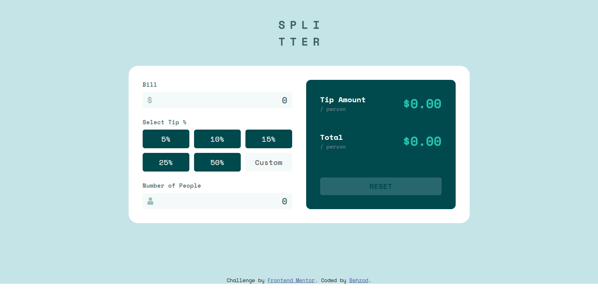

# Frontend Mentor - Tip calculator app solution

This is a solution to the [Tip calculator app challenge on Frontend Mentor](https://www.frontendmentor.io/challenges/tip-calculator-app-ugJNGbJUX). Frontend Mentor challenges help you improve your coding skills by building realistic projects.

## Table of contents

- [The challenge](#the-challenge)
- [Screenshot](#screenshot)
- [Links](#links)
- [Built with](#built-with)

## The challenge

Users should be able to:

- View the optimal layout for the app depending on their device's screen size
- See hover states for all interactive elements on the page
- Calculate the correct tip and total cost of the bill per person

## Screenshot

## Links

- Solution URL: [https://github.com/Wolverine1122/tip-calculator-app](https://github.com/Wolverine1122/tip-calculator-app)
- Live Site URL: [https://projects-tipcalculatorapp.netlify.app/](https://projects-tipcalculatorapp.netlify.app/)

## Built with

- Semantic HTML5 markup
- SCSS (Sassy CSS) custom properties
- JavaScript
- CSS Grid
